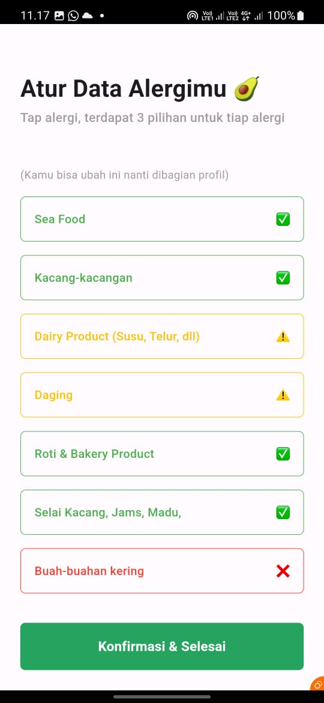

[![Contributors][contributors-shield]][contributors-url]

[![Forks][forks-shield]][forks-url]

[![Stargazers][stars-shield]][stars-url]

[![Issues][issues-shield]][issues-url]

[![MIT License][license-shield]][license-url]

<!-- PROJECT LOGO -->

<br />

<div  align="center">

<a  href="https://github.com/codeyzx/geats">


</a>

<h3  align="center">NutriScan by Kicau Mania</h3>

<p  align="center">

NutriScan provides personalized food recommendations and detailed nutritional insights, empowering you to make informed choices. Easily donate excess or food you buy but have allergic to in mission positively impact your community.

<br/>
<br/>

<a  href="https://github.com/emrsyah/NutriScan">View Demo</a>
·
<a  href="https://github.com/emrsyah/NutriScan/issues">Report Bug</a>
·
<a  href="https://github.com/emrsyah/NutriScan/issues">Request Feature</a>

</p>

</div>

## Features


### 1. Food Recommendation & Personalization

NutriScan would recommend you food based on your allergics preferences, this food would be personalize based on your data, you can easily to find food whereas suit for your allergic preferences now with easily.

### 2. Food Allergic Analysis

You can easily know if a food contain your allergic or not, they would inform you whether the food is good for you, if its contain the ingredients you need to watch out or even food with your allergic. It even detailed to the ingredients level, you will know the status of your allergic with each of the food ingredients.

### 3. Product Scan Using OCR

We help you to analyze the product you want to buy easily through scanning the name of the product, this way you can see the food ingredients so you dont need to doing some google search again everytime you want to buy some food products.

### 4. Donation - Find

NutriScan provide you with donation features, in the find section you can easily see the donation from other people, you can also activate your position to exactly know the distance between you and the food provider, it even give you directions to the food provider with ease.

### 5. Donation - Provide

Got extra food or accidentally bought something you're allergic to? Share the love by donating it through NutriScan. Easily contribute your food items, making a positive impact with NutriScan's donation feature.

### 6. Exchange Your Donation Points (Soon)

The true reward of your donation is, of course, the positive impact you create. However, we're also working on a feature where you can soon exchange your donation points for exciting benefits.

## Technologies Used

- Flutter
- Firebase (Authentication, Firestore Database, Storage)
- Google ML Kit
- Google Maps API

## Getting Started

1. Clone the repository:
   ```sh
   git clone https://github.com/emrsyah/NutriScan.git .
   ```
2. Install dependencies:
   ```sh
   flutter pub get
   ```
3. Run the application:
   ```sh
   flutter run
   ```

## Demo App

| Image 1                            | Image 2                            |
| ---------------------------------- | ---------------------------------- |
|  |  |

| Image 3                            | Image 4                            |
| ---------------------------------- | ---------------------------------- |
|  |  |

| Image 5                            | Image 6                            |
| ---------------------------------- | ---------------------------------- |
|  |  |

| Image 7                            | Image 8                            |
| ---------------------------------- | ---------------------------------- |
|  |  |

| Image 9                            | Image 10                             |
| ---------------------------------- | ------------------------------------ |
|  |  |

| Image 11                           | Image 12                             |
| ---------------------------------- | ------------------------------------ |
| |  |

| Image 13                           | Image 14                             |
| ---------------------------------- | ------------------------------------ |
| |  |

| Image 15                           | Image 16                            |
| ---------------------------------- | ------------------------------------ |
| |  |


## License

Distributed under the MIT License. See `LICENSE.txt` for more information.

## Created by Kicau Mania Team 
- Muhammad Emirsyah Makarim (Hipster)
- Ario Bimo Munfadhil (Hacker)
- Hafizh Al-Kautsar (Hustler)
<!-- MARKDOWN LINKS & IMAGES -->

<!-- https://www.markdownguide.org/basic-syntax/#reference-style-links -->

[contributors-shield]: https://img.shields.io/github/contributors/emrsyah/NutriScan.svg?style=for-the-badge
[contributors-url]: https://github.com/emrsyah/NutriScan/graphs/contributors
[forks-shield]: https://img.shields.io/github/forks/emrsyah/NutriScan.svg?style=for-the-badge
[forks-url]: https://github.com/emrsyah/NutriScan/network/members
[stars-shield]: https://img.shields.io/github/stars/emrsyah/NutriScan.svg?style=for-the-badge
[stars-url]: https://github.com/emrsyah/NutriScan/stargazers
[issues-shield]: https://img.shields.io/github/issues/emrsyah/NutriScan.svg?style=for-the-badge
[issues-url]: https://github.com/emrsyah/NutriScan/issues
[license-shield]: https://img.shields.io/github/license/othneildrew/Best-README-Template.svg?style=for-the-badge
[license-url]: https://github.com/emrsyah/NutriScan/blob/main/LICENSE.txt
